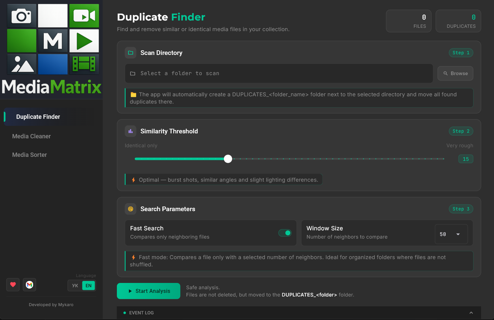
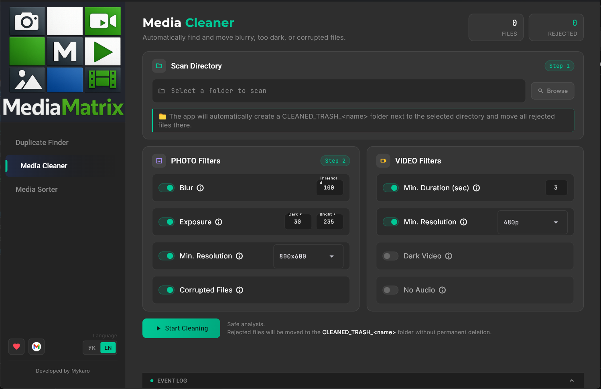
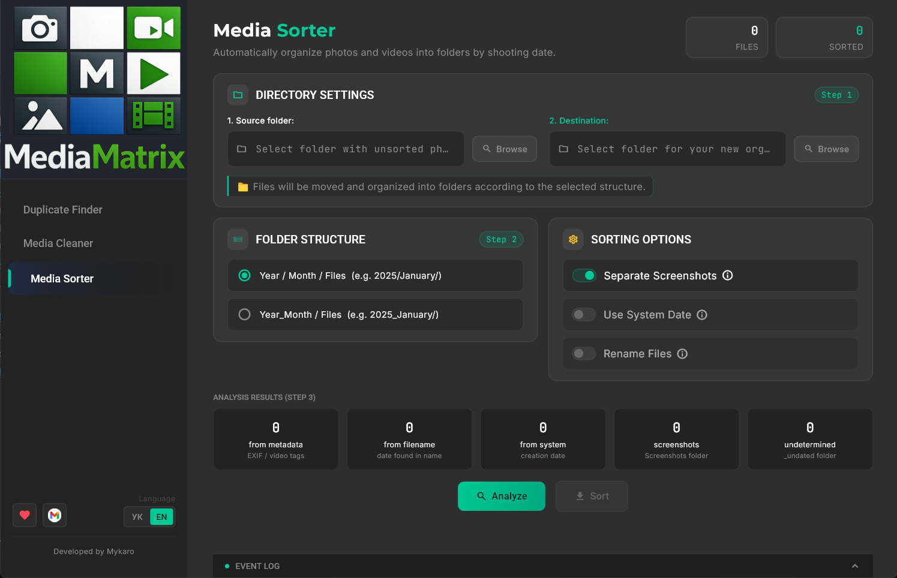

# 🎬 MediaMatrix: Your media file organization made simple

> **A convenient and fast application to bring perfect order to your photos and videos.**

  

> _(Portable — No installation required. Just extract the archive and run!)_

  
  
  

---

## 🤔 Why MediaMatrix?

Over time, we all accumulate thousands of photos and videos. Many of them are duplicates, blurry shots, overly dark pictures, or short, failed videos. Sorting through them manually takes hours or even days of tedious work.

**MediaMatrix** solves this problem: it automatically analyzes your media library, finds the "junk", sorts files, and frees up your disk space.

---

## 🚀 How It Works

Getting started is very easy:

1. **Open the app** and select the desired tool from the sidebar (Duplicate Finder, Cleaner, or Sorter).
2. **Select the folder** containing your photos and videos.
3. **Adjust the settings** (e.g., blur sensitivity) and click the start button.
4. **Get the result!** The program will organize your files and move the failed shots, saving you time.

---

## ✨ Features

- 👯 **Duplicate Finder (TwinFinder)** — Finds identical files and helps delete extra copies, freeing up gigabytes of memory.
- 🧹 **Cleaner (PhotoCleaner)** — Detects blurry, overly dark or overexposed photos, low-quality files, as well as short or corrupted videos.
- 📂 **Smart Sorting (PhotoSorter)** — Neatly organizes your media files into convenient folders (for example, by creation date).
- ⚡ **High Speed** — Quickly scans and analyzes large volumes of files thanks to optimized algorithms.
- 🌙 **User-Friendly Design** — A simple, clear, and stylish interface that requires no special knowledge.

---

## 🔒 Privacy & Security

Your memories are completely safe:

- 💻 **100% Local** — All analysis and processing happen exclusively on your computer.
- ☁️ **No Cloud** — Not a single file is sent to the internet or third-party servers.
- 🛡️ **Zero Tracking** — The program does not collect user data and contains no hidden analytics.

---

## 💻 System Requirements

- Windows 10 or later

---

## 🐛 Feedback

If something doesn't work as you expected, or you have an idea for a new feature — open an Issue on GitHub or email me at: <bymykaro@gmail.com>  
Every report helps make MediaMatrix better.

---

## 📄 License

Copyright (C) 2026 Mykaro

This project is licensed under the **GNU General Public License v3.0**. See the [LICENSE](LICENSE) file for details.

---

_Made with care for your media library._
